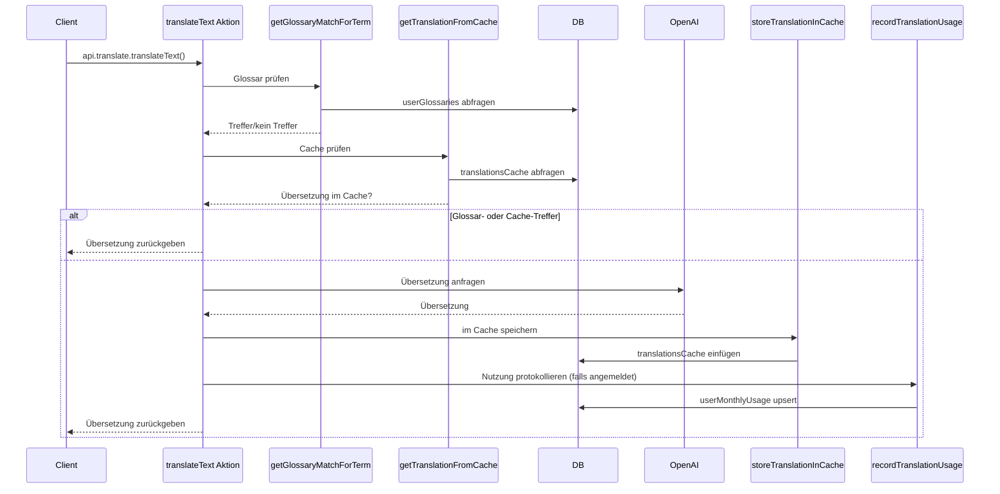

# Translation App Backend and Frontend
  
This is a project built with [Chef](https://chef.convex.dev) using [Convex](https://convex.dev) as its backend.
  
This project is connected to the Convex deployment named [`resilient-herring-727`](https://dashboard.convex.dev/d/resilient-herring-727).
  
## Project structure
  
The frontend code is in the `app` directory and is built with [Vite](https://vitejs.dev/).
  
The backend code is in the `convex` directory.
  
`npm run dev` will start the frontend and backend servers.

## App authentication

Chef apps use [Convex Auth](https://auth.convex.dev/) with Anonymous auth for easy sign in. You may wish to change this before deploying your app.

## Developing and deploying your app

Check out the [Convex docs](https://docs.convex.dev/) for more information on how to develop with Convex.
* If you're new to Convex, the [Overview](https://docs.convex.dev/understanding/) is a good place to start
* Check out the [Hosting and Deployment](https://docs.convex.dev/production/) docs for how to deploy your app
* Read the [Best Practices](https://docs.convex.dev/understanding/best-practices/) guide for tips on how to improve you app further

## HTTP API

User-defined http routes are defined in the `convex/router.ts` file. We split these routes into a separate file from `convex/http.ts` to allow us to prevent the LLM from modifying the authentication routes.

## Ablauf einer Anfrage

Der Client ruft die Aktion `translateText` über `api.translate.translateText` in
`src/App.tsx` auf. Diese Aktion führt mehrere Schritte aus, um die endgültige
Übersetzung zurückzugeben und die Nutzung zu protokollieren:

1. **Glossar-Abfrage** – Ist ein Benutzer angemeldet, fragt `translateText`
   mithilfe von `getGlossaryMatchForTerm` die Tabelle `userGlossaries` nach einer
   vorhandenen benutzerdefinierten Übersetzung ab.
2. **Cache-Abfrage** – Wird kein Glossareintrag gefunden, prüft die Aktion mit
   `getTranslationFromCache` die Tabelle `translationsCache`.
3. **Externe API** – Bei einem Cache-Miss ruft sie die OpenAI-API auf, um eine
   Übersetzung zu erhalten.
4. **Ergebnis speichern** – Die neue Übersetzung wird mit
   `storeTranslationInCache` gespeichert und die Nutzung via
   `recordTranslationUsage` in `userMonthlyUsage` festgehalten.

Der komplette Ablauf ist im folgenden Diagramm dargestellt:

