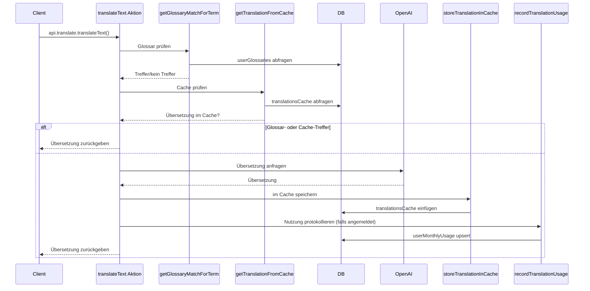

# Übersetzungs-App Backend und Frontend
  
Dies ist ein Projekt, das mit [Chef](https://chef.convex.dev) erstellt wurde und [Convex](https://convex.dev) als Backend verwendet.
  
Dieses Projekt ist mit der Convex-Bereitstellung namens [`resilient-herring-727`](https://dashboard.convex.dev/d/resilient-herring-727) verbunden.
  
## Projektstruktur
  
Der Frontend-Code befindet sich im Verzeichnis `app` und wird mit [Vite](https://vitejs.dev/) erstellt.
  
Der Backend-Code befindet sich im Verzeichnis `convex`.
  
`npm run dev` startet die Frontend- und Backend-Server.

## App-Authentifizierung

Chef-Apps verwenden [Convex Auth](https://auth.convex.dev/) mit anonymer Anmeldung für einen einfachen Login. Möglicherweise möchten Sie dies ändern, bevor Sie Ihre App bereitstellen.

## Entwickeln und Bereitstellen Ihrer App

Weitere Informationen zur Entwicklung mit Convex finden Sie in der [Convex-Dokumentation](https://docs.convex.dev/).
* Wenn Sie neu bei Convex sind, ist die [Übersicht](https://docs.convex.dev/understanding/) ein guter Ausgangspunkt
* Informationen zum Bereitstellen Ihrer App finden Sie in der Dokumentation zu [Hosting und Bereitstellung](https://docs.convex.dev/production/).
* Lesen Sie den [Best Practices](https://docs.convex.dev/understanding/best-practices/) Leitfaden für Tipps zur weiteren Verbesserung Ihrer App

## HTTP-API

Benutzerdefinierte HTTP-Routen werden in der Datei `convex/router.ts` definiert. Wir haben diese Routen in eine separate Datei von `convex/http.ts` aufgeteilt, um zu verhindern, dass das LLM die Authentifizierungsrouten ändert.

## Ablauf einer Anfrage

Der Client ruft die Aktion `translateText` über `api.translate.translateText` in
`src/App.tsx` auf. Diese Aktion führt mehrere Schritte aus, um die endgültige
Übersetzung zurückzugeben und die Nutzung zu protokollieren:

1. **Glossar-Abfrage** – Ist ein Benutzer angemeldet, fragt `translateText`
   mithilfe von `getGlossaryMatchForTerm` die Tabelle `userGlossaries` nach einer
   vorhandenen benutzerdefinierten Übersetzung ab.
2. **Cache-Abfrage** – Wird kein Glossareintrag gefunden, prüft die Aktion mit
   `getTranslationFromCache` die Tabelle `translationsCache`.
3. **Externe API** – Bei einem Cache-Miss ruft sie die OpenAI-API auf, um eine
   Übersetzung zu erhalten.
4. **Ergebnis speichern** – Die neue Übersetzung wird mit
   `storeTranslationInCache` gespeichert und die Nutzung via
   `recordTranslationUsage` in `userMonthlyUsage` festgehalten.

Der komplette Ablauf ist im folgenden Diagramm dargestellt:

